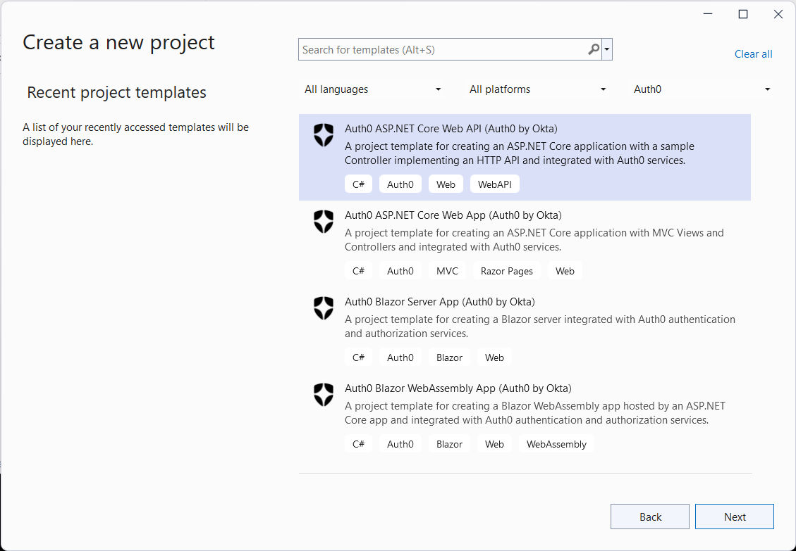
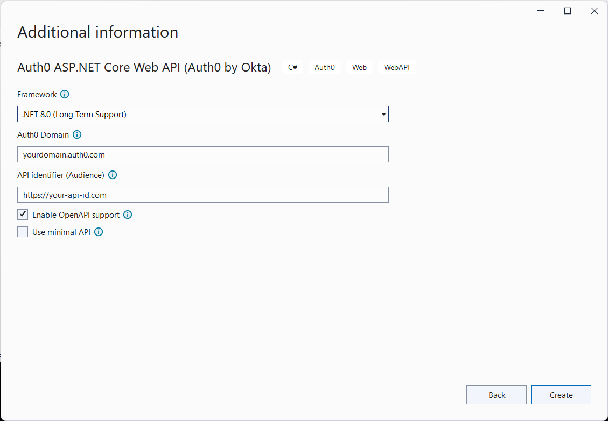
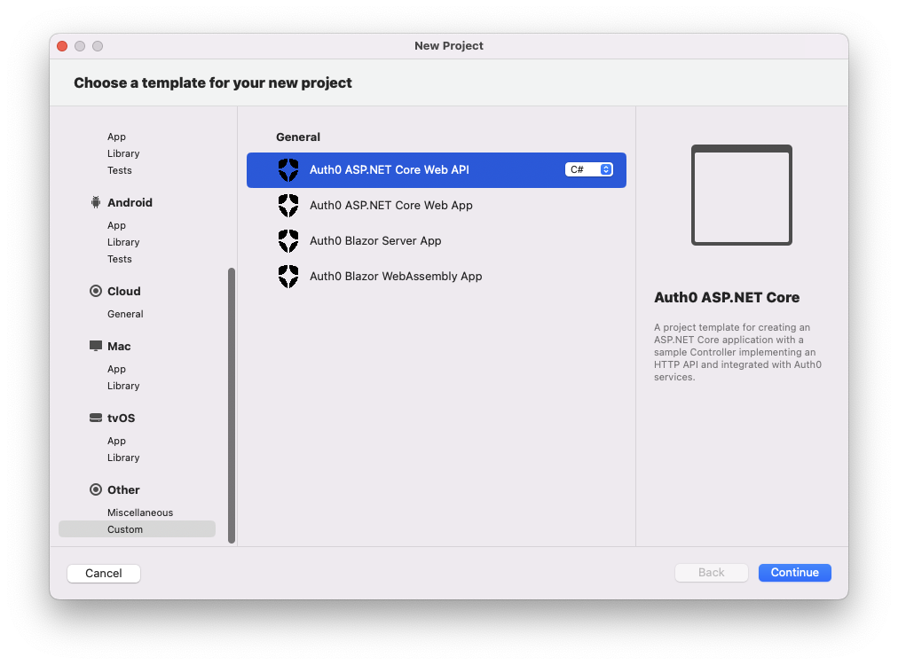
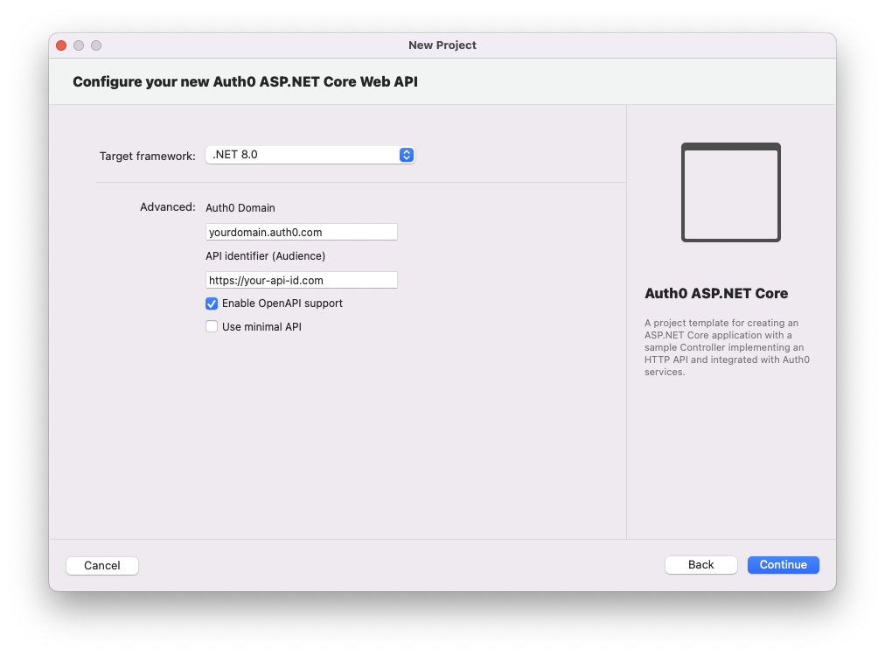

## Auth0 Web API Application

For more information about creating and securing an ASP.NET Web API application with Auth0, check out the [Auth0 ASP.NET Web API Quickstart](https://auth0.com/docs/quickstart/backend/aspnet-core-webapi).

#### Using the .NET CLI

To create a new Web API application, you can run the following command:

```
dotnet new auth0webapi [options]
```

This will create a new Web API application with Auth0 support in the current folder. 

##### Manual registration

In addition to the usual options for the `dotnet new` command, the following template-specific options are available:

- `--domain`<br>
  The Auth0 domain associated with your tenant. The default value is `yourdomain.auth0.com`.
- `--audience`<br>
  The API identifier (audience) as defined in your Auth0 dashboard. The default value is `https://your-api-id.com`
- `-f` or `--framework`<br>
  Defines the target framework to use for the .NET project. Currently, the only possible value is `net7.0`, which is also the default value.
- `--no-openapi`<br>
  It prevents OpenAPI documentation generation (`true`). The default value is `false`.
- `--minimal`
  It creates a project that uses the [ASP.NET Core minimal API](https://learn.microsoft.com/en-us/aspnet/core/fundamentals/minimal-apis). Default is `false`.

Example:

```shell
dotnet new auth0webapi -o MyWebAPI --domain myapp.auth0.com --audience https://myapi.com
```

##### Automatic registration

If you have the [Auth0 CLI](https://github.com/auth0/auth0-cli) installed on your machine, you can run the template command without any options and it will automatically register and configure your application with Auth0.

Example:

```shell
dotnet new auth0webapi -o MyWebAPI
```

The template engine will ask for confirmation to perform the registration action.

#### Using Visual Studio for Windows

To create a new Web API application with Visual Studio for Windows, select *Auth0* from the project types dropdown list and then *Auth0 ASP.NET Core Web API*:



Then, after inserting the name and the folder for the project, provide the required options:



#### Using Visual Studio for Mac

To create a new Web API application with Visual Studio for Mac, select *Custom* from the *Other* project types list and then *Auth0 ASP.NET Core Web API*:



Then, after inserting the name and the folder for the project, provide the required options:




---

[Back to README](../README.md)

